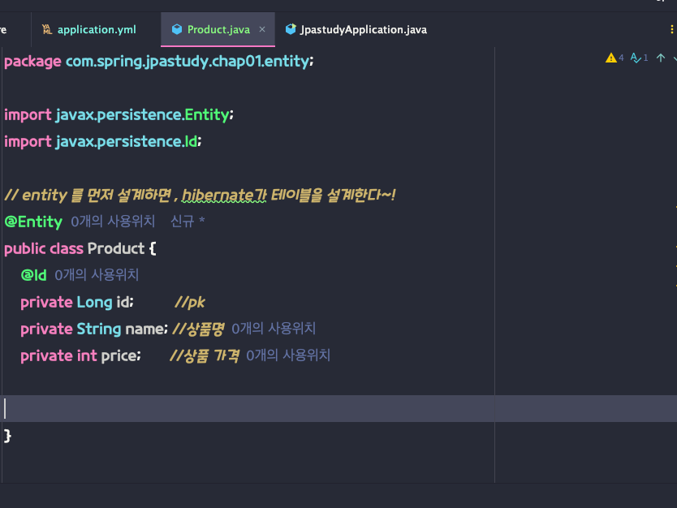

```dtd
// entity 를 먼저 설계하면 , hibernate가 테이블을 설계한다~!
@Entity
public class Product {
    @Id
    private Long id;          //pk
    private String name; //상품명
    private int price;       //상품 가격


}
```