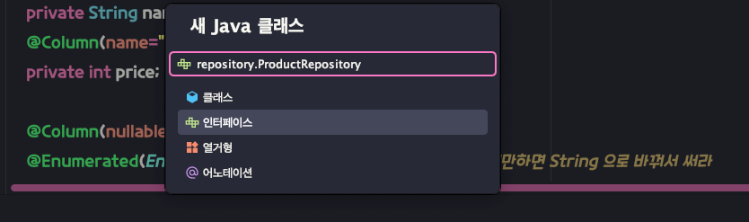

⭐️mapper 대신 
JpaRepository 상속 받아서 인터페이스 만들어주기
```dtd
//extends JpaRepository 만 붙여주면 됨~!⭐️ (crud 완료)
// jpaRepository를 상속한후
//첫번쨰 제너릭엔 엔터티 클래스 타입,
// 두번째 제널익엔 pk 타입 넣기 !
public interface ProductRepository extends JpaRepository<Product, Long> {
```

---

```dtd
package com.spring.jpastudy.chap02.entity;

import lombok.*;
import org.hibernate.annotations.GenericGenerator;

import javax.persistence.*;

@Setter
@Getter
@ToString
@EqualsAndHashCode(of="id")
@NoArgsConstructor
@AllArgsConstructor
@Builder

@Entity
@Table(name="tbl_student")
public class Student {
    //랜덤 문자로 pk 지정
    @Id
    @Column(name = "stu_id")
    @GeneratedValue(generator = "abc")
    @GenericGenerator(strategy = "uuid", name="abc")     //
    private String id;

    @Column(name = "stu_name", nullable = false)
    private String name;

    private String city;

    private String major;


}

```

@GeneratedValue(generator = "abc")
@GenericGenerator(strategy = "uuid", name="abc")     //
generator = "abc") == name 같아야함


@GeneratedValue(generator = "abc"):

JPA에서 기본 키(Primary Key)를 자동으로 생성하는 방법을 지정합니다.
이 경우, "abc"라는 이름의 생성기를 사용하여 기본 키를 생성합니다.

@GenericGenerator(strategy = "uuid", name="abc"):

기본 키 생성 전략을 지정합니다.
"uuid" 전략은 UUID(Universally Unique Identifier) 알고리즘을 사용하여 고유한 문자열 ID를 생성합니다.
"abc"는 생성기의 이름으로, @GeneratedValue에서 참조하는 이름과 일치해야 합니다.

이렇게 설정하면 
Student 엔티티의 id 필드는 자동으로 UUID 형식의 고유한 문자열 값으로 생성됩니다. 
UUID는 분산 환경에서도 고유성이 보장되는 식별자이므로, 데이터베이스의 기본 키로 사용하기 적합합니다.

이러한 방식으로 기본 키를 생성하면 
데이터베이스 테이블의 기본 키 생성을 JPA 프레임워크에 위임할 수 있어, 
개발자가 직접 기본 키를 관리할 필요가 없습니다. 또한 UUID 기반의 고유한 식별자를 사용함으로써
데이터의 무결성을 보장할 수 있습니다.